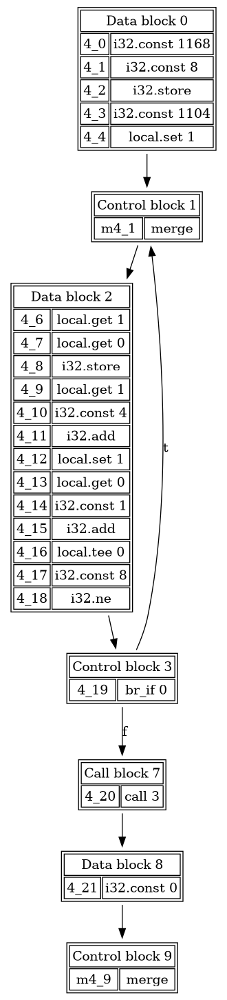

# Wassail
`wassail` (WebAssembly static analyzer and inspection library) is a toolkit to perform both lightweight and heavyweight static analysis of WebAssembly modules.

  - [Web version](#webversion)
  - [Installation](#installation)
  - [Usage](#usage)
  - [Contributing](#contributing)

# Web version
Parts of Wassail can be run in your web browser [here](https://acieroid.github.io/wassail/).

# Installation
0. Install [opam](https://opam.ocaml.org/)

1. Run `opam install core_unix`

2. Run `opam install .`

# Usage
Wassail can perform a number of tasks on WebAssembly modules, both in their textual representation (`.wat` files) or in their binary representation (`.wasm`)
## Listing imports
```sh
$ wassail imports foo.wasm
0	time	i32 -> i32
1	ctime	i32 -> i32
2	roundf	f32 -> f32
...
```
## Listing exports
```sh
$ wassail exports foo.wasm
11563	atof	i32 -> f64
11586	strlen	i32 -> i32
11483	fopen	i32, i32 -> i32
...
```

## Listing section sizes
Section sizes are reported in bytes.
```sh
$ wassail sizes foo.wasm
1962	type
8724	import
13120	func
0	table
0	memory
23	global
1316	export
0	start
9480	elem
2063620	code
507825	data
```

## Generating Call Graphs
To generate the call graph for a module `foo.dot`:

```sh
$ wassail callgraph benchmarks/benchmarksgame/fankuchredux.wat foo.dot
```

Output graph:


## Generating Control-Flow Graphs
You can either generate a single CFG, for example to generate the CFG of function 1 from file `foo.wat` into `foo.dot`:

```sh
$ wassail cfg foo.wasm 1 foo.dot
```

Or you can generate all CFGs in a given directory:

```sh
$ wassail cfgs foo.wat out/
```

Example output:



# Contributing
Contributions are welcome! Wassail is licensed under the conditions of the GPLv3.0 license with a non-commercial usage clause.

## Running the tests

```sh
$ make test
```


## Using the web interface

You can access the web interface [here](https://acieroid.github.io/wassail/), or compile it for yourself as follows:

```sh
$ opam install js_of_ocaml js_of_ocaml-ppx
$ make js
$ open js/index.html
```
# References

The following publications use Wassail:

  - [Compositional Information Flow Analysis for WebAssembly Programs](http://soft.vub.ac.be/~qstieven/scam2020wasm/), SCAM 2020. ([pdf](http://soft.vub.ac.be/Publications/2020/vub-tr-soft-20-11.pdf), [video](https://www.youtube.com/watch?v=IX8swyZ4TPI))
  - [Wassail: A WebAssembly Static Analysis Library](https://soft.vub.ac.be/Publications/2021/vub-tr-soft-21-04.pdf), ProWeb 2021.
  - [Static Stack-Preserving Intra-Procedural Slicing of WebAssembly Binaries](https://soft.vub.ac.be/Publications/2022/vub-tr-soft-22-04.pdf), ICSE 2022.
  - [Dynamic Slicing of WebAssembly Binaries](http://soft.vub.ac.be/Publications/2023/vub-tr-soft-23-11.pdf), ICSME 2023.
  
